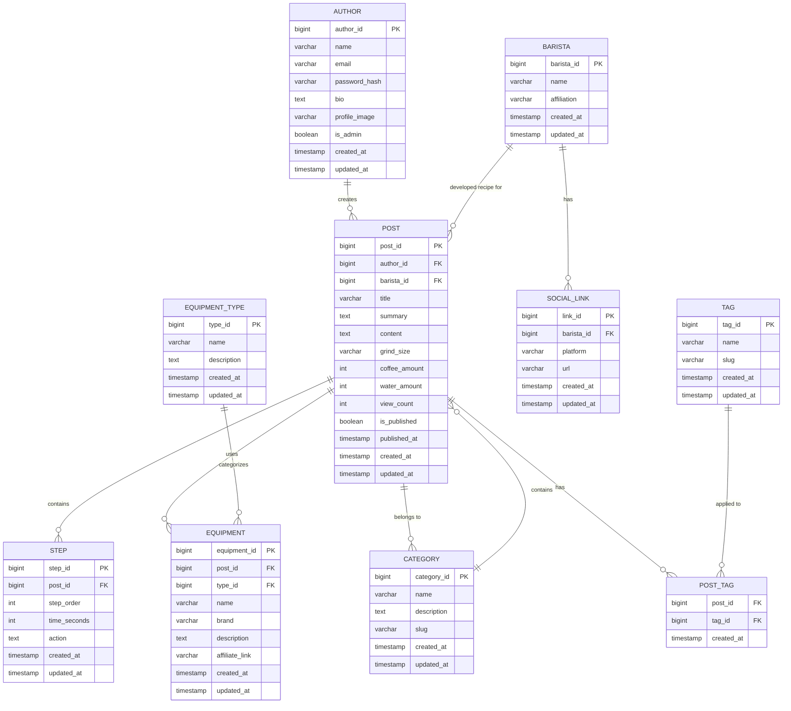

# システムパターン

本プロジェクトは、Next.js の AppRouter 機能と、[bulletproof-react](https://github.com/pomber/bulletproof-react) のベストプラクティスに基づいたアーキテクチャを採用しています。本ドキュメントでは、全体の設計方針と各層の役割、フォルダ構成、エラーハンドリング、テスト戦略などについて記述します。

## 1. Next.js AppRouter の活用

- **ファイルベースルーティング:**
  - `/app` ディレクトリを利用してページやレイアウトを定義
  - 各ルートに対して、専用のエラーバウンダリやローディングコンポーネントを設定
- **サーバーコンポーネントとクライアントコンポーネントの役割分離:**
  - **サーバーコンポーネント:** 初期データのフェッチ、SEO対策、レンダリングを担当
  - **クライアントコンポーネント:** ユーザーインタラクション、動的なUIの制御を担当
- **エラーハンドリングとローディング:**
  各ルートで Next.js のエラーバウンダリとローディング UI を適切に配置

## 2. フォルダ構成とコンポーネント設計

- **機能ベースの構成:**
  - `/features`: 機能（ドメイン）ごとのコンポーネントとロジック
    - `components/`: UI コンポーネント
    - `data/`: データ定義やモックデータ
    - `types/`: 型定義ファイル
- **共通コンポーネント:**
  - `/components`: 再利用可能な共通UIコンポーネント
- **データベース関連:**
  - `/db`: Prismaスキーマとマイグレーションファイル

## 3. データベース設計（PostgreSQL + Prisma）

### ER図

以下は本システムにおける主要なエンティティと、それらの関係性を表したER図です。これにより、データ構造の全体像を把握しやすくなります。

### テーブル構造

1. **posts**
   - レシピの基本情報を管理
   - タイトル、説明、抽出条件などを保持

2. **steps**
   - レシピの手順を管理
   - 順序、時間、アクションを記録

3. **equipment**
   - 使用する器具の情報を管理
   - 名前、ブランド、アフィリエイトリンクを保持

4. **categories**
   - レシピのカテゴリ分類
   - 名前、説明、スラッグを管理

### リレーション

- posts - steps: 1対多
- posts - equipment: 多対多
- posts - categories: 多対多

## 4. データアクセス戦略

- **Prisma Client の活用:**
  - 型安全なデータアクセス
  - トランザクション管理
  - リレーション処理の効率化

- **キャッシュ戦略:**
  - サーバーサイドでのキャッシング
  - 静的生成とISRの併用

## 5. エラーハンドリングと例外処理

- **データベースエラー:**
  - Prisma エラーの適切なハンドリング
  - ユーザーフレンドリーなエラーメッセージ

- **API エラー:**
  - HTTPステータスコードの適切な使用
  - エラーレスポンスの標準化

## 6. パフォーマンス最適化

- **データベースクエリの最適化:**
  - インデックス設計
  - N+1問題の回避
  - クエリの効率化

- **フロントエンド最適化:**
  - 画像の最適化
  - コンポーネントの遅延ロード
  - バンドルサイズの最適化

## 7. セキュリティ対策

- **データベースセキュリティ:**
  - 環境変数による認証情報の保護
  - アクセス制御の実装

- **API セキュリティ:**
  - 入力バリデーション
  - CORS設定
  - レート制限の実装
